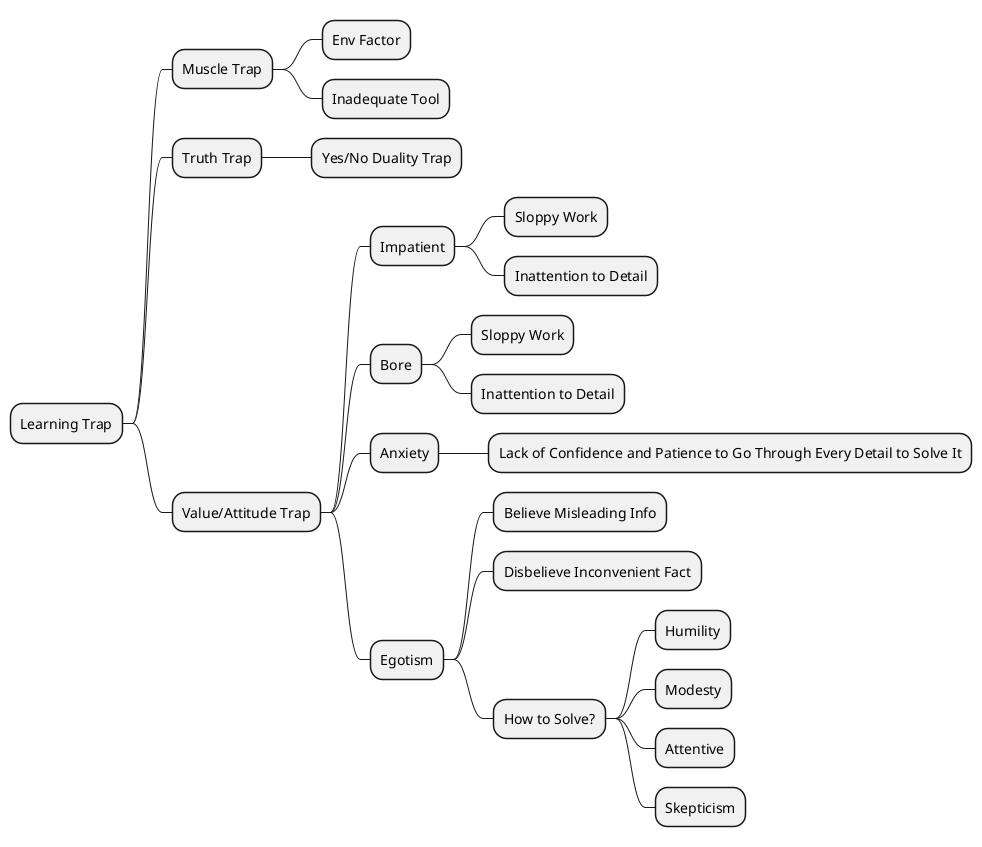

ref: kindle Note from chapter 24 to the end of section 3

學習陷阱
- 肌肉 trap is more about 環境因素，工具熟練度

真相陷阱
- 不要陷入是否對錯


態度陷阱
- 沒耐心, 覺得無聊 
- 都會導致 sloppy work and 沒有注意到細節


焦慮
- 會導致信心不足，進而造成 task 無法完成，沒注意到細節等等


自大，自以為是，自認為自己懂
- 錯誤資訊-> task done wrongly
- 相信自己想要相信的


正確的心態應該是
- 謙遜
- 留心
- 懷疑論



```txt fold


- learning trap
	- muscle trap
		- env factor
		- inadeqte tool
	- truth trap
		- yes/no duality trap
	- value/attitude trap
		- impatient
			- sloppy work
			- inattention to detail
		- bore
			- sloppy work
			- inattention to detail
		- anxiety
			- lack of confident and patient to go thru every details to solve it
		- egotism
			- believe misleading info
			- disbelieve inconvient fact
			- how to solve? 
				- humility
				- modesty
				- attentive
				- skeptism


```
 


自私可能會鼓勵人們相信誤導性資訊或不相信可能令人不舒服的事實。適當的手段包括謙虛、謙虛、專注和懷疑。

焦慮可能會妨礙開始專案所需的信心或系統地耐心完成專案所需的自信。

無聊可能會導致工作馬虎和不注意細節。

不耐煩，就像無聊一樣，可能會導致工作馬虎和不注意細節。

「真相陷阱」 依賴是 / 否二元性可能會導致對結果的誤解。 Pirsig 注意到 mu 的概念，並建議特定問題的答案可能表明該問題與情況不符。

「肌肉陷阱」 工具不足可能會導致挫折感。適當的資源包括適當的設備採購。

環境因素可能會導致沮喪，包括照明不足、極端溫度和身體不舒服的姿勢。

肌肉不敏感或缺乏本體感覺可能會導致對材料施加不成比例的力，從而導致挫折感


---

# 卡住了怎麼辦?
    
  

Note motor repair art and solution - What shall you do and think when you stuck?


## Be Better

一个人在修理摩托车的时候，对车子的了解分分秒秒都在改变，因而得到了全新认识，其中蕴含了更多的良质。修理的人不会受限于传统的做法，因为他有足够理性的基础拒绝这些思想。真实不再是静态的，它不是让你决定是要去奋战还是打退堂鼓的思想，它们是会跟着你成长的思想。所以具有良质的真实，它的本质不再是静态的，而具有爆炸性的威力，一旦你了解了这一点，就永远不会被卡住了。它虽然有形式，但是这种形式可以改变。

美国政府并不是静态的，如果我们不喜欢它的现状，就可以寻求某种更好的方法。所以美国政府不会受限于任何僵化的教条主义。所以关键在于 " 更好 "-- 良质。

或许有人会认为，美国政府的基本结构是不变的，所以无法为了产生更好的效果而改变。但是这种论点并没有切中要害。重点是总统和从最激进到最保守的每一个百姓都同意，政府为了要有更好的表现就应该改变。斐德洛认为这种不断改变的良质才是真实的，整个政府都要为之改变。虽然我们没有说出来，但是所有的人都有这种信念。

解决的方法一开始看似不重要或是不必要，但是被卡住的那段时间让它有机会显示出真正的重要性。它之所以被认为微不足道，是因为导致你被卡住的价值观太过僵硬所造成的。

但是让我们来思考这个事实，不论你被卡得多严重，这种现象终将消失。你的心灵终究会很自然地找到解决的办法，除非你非常容易被卡住。


## 卡住代表了進步的機會


其实怕被卡住是不必要的，因为被卡住得愈久，你就愈看得清楚让你脱困的良质。所以不应逃避被卡住的情形，它是达到真正了解之前的心灵状态。要想了解良质，不论是在技术工作上或是其他方面，无私地接纳这种被卡住的现象是个关键。无师自通的技术人员就是因为常常被卡住，才比接受学院训练的人员更了解良质。因为他们懂得如何处理突发的状况。

一般来说，螺丝非常便宜又不重要，所以不受重视，但是一旦你具有更强烈的良质意识，你就知道这颗小小的螺丝一点儿都不会不起眼，它甚至十分重要。现在这颗螺丝其实与整部摩托车的价值相同，因为如果你没有办法把螺丝拿下来，那么摩托车就根本发动不了。由于重新评估了螺丝，你就会愿意进一步认识它。

我猜想拥有更深刻的了解就会对螺丝有新的评价。如果你把注意力集中在这上面很长一段时间，那么你可能会发现，螺丝并不只是属于某一类物体，它更有自己独特的个性。如果你再深入研究，你就会发现螺丝并不单单只是螺丝，它代表了一组功能。于是你原先被卡住的现象就会逐渐消失，同时也消除了传统理性的模式。过去你把各种事物都划分成主客观两面，你的思想就变得非常呆板，你把螺丝归入固定的类别，它比你所看到的事实还要真实，还要不可侵犯。

由于你看不到任何新的构想和新的层面，所以一旦被卡住的时候，你就会束手无策。现在为了要把螺丝拿下来，你对它究竟是什么已经不感兴趣了。它的功能才是你研究的重点。于是你会提出有关功能方面的问题，由你的问题就可以知道你对良质的分辨能力。只要其中有良质，你究竟用什么方法解决它已经不重要了。你想到螺丝不但坚硬而且牢固，再加上有螺纹，你自然而然就会想到需要用压紧的方法和溶剂。这就是一种含有良质的解决方法。另外一种方法很可能要到图书馆去找一本机械用具的目录，查出哪一种螺丝刀能解决你的问题。或者你也可以打电话给了解机械的朋友。或是硬把螺丝给拔出来，甚至把它给烧了。再不就经过一番沉思之后，想出把螺丝拔出来的新方法，因而申请到专利，让你在五年之内变成百万富翁。所以解决的方法多得难以预估。一旦等你想出来之后，你就会发现方法都很简单。也只有在知道答案之后，才会觉得简单。


## 製造和藝術

约翰夫妇所厌恶的丑陋并不是科技与生俱来的，只是对他们来说是如此。我们很难把科技中的丑陋单独分离出来。科技只是制造物品，而制造物品本身并不丑陋。否则艺术品就不可能产生美感了，因为艺术也是制造物品

實际上科技这个词的词根就意味着艺术。在古代希腊人心中，从未把艺术和制造分开过，所以二者根本就是同一个词。在现代科技的原料当中，丑陋也不是与生俱来的 -- 有的时候你可能会听到这样的论调。大量生产的塑胶制品本身并不坏，它们只是引起不好的联想。一个人如果终生关在监狱的石室中，他可能认为石头天生就是很丑陋的，虽然石头也是雕塑的主要材料。一个人如果终生就生活在丑陋的塑胶制品之中，从他童年时期使用的玩具，以至一生的消费品，都是塑胶制的，这样的人就可能认为塑胶品的丑陋是与生俱来的。但是现代科技真正丑陋的地方并不在材料或者形状或者这种生产方式和产品上，这些只是低品质的物品所有的特质。

要解决人类价值和科技需求之间的冲突并不需要逃避科技 -- 这是不可能的。方法在于打破传统的二分法，进而真正了解科技的本质 -- 并不是窃用自然，而是把自然与人的精神融合为一，创造出可以超越二者的产物。

当这种产物已经出现，就像第一架横越海洋的飞机，或是人类第一次踏上月球，全人类就会对科技的超越性有全新的认识。但是同时在个人生活当中，也需要提升自己的精神层次。

如果你想要有高水准的表现，就必须具备鉴赏力以及达到目标的方法，也就是同时具有对良质的古典和浪漫的认知。

然而如果你想得到如何进行这类工作的指导，我们的文化只会给你古典的认知方法，也就是告诉你，磨刀的时候该如何拿刀子，或者如何使用缝纫机，或者如何混合胶水，如何擦胶水，它认为只要你照着这些步骤去做，自然会有高水准的表现。然而，它把鉴赏力给忽略了。于是就产生了现代科技非常典型的结果，为了让人容易接受它沉闷的外表，就在外面加一层包装。

然而对于那些对浪漫的良质十分敏锐的人来说，这种情形更糟，因为它不只乏味到令人沮丧，同时还有虚伪的矫饰。把这两者加起来，你就可以得到现在美国科技精确的形象：流行的汽车、流行的摩托车、流行的打字机、流行的时装。流行的冰箱里装着流行的食物，摆在流行的厨房里，房子也是流行的。流行的塑胶玩具给流行的小孩。在圣诞节和过生日的时候，流行的小孩和他们流行的父母一起参加流行的聚会。你得经常跟上流行而不厌倦，所以你落入了流行的陷阱之中。

有一群人从来不知道世界上有良质的存在，为了制造美感和利益，就在科技丑陋的外表上蒙了一层厚厚的浪漫的虚伪。良质并不是外加在主体和客体上的，就像圣诞树上闪亮亮的装饰品。真正的良质是主客观的源头，也是树木的生长点。

为了得到良质，需要采取和二元化的科技不同的步骤，排除其中的步骤一、步骤二、步骤三 …… 这就是我准备讨论的主题


## 追求心靈平靜

在狄威斯家里的时候，我曾经谈到，工作的时候要保持内心的宁静，并因此被他们取笑，那是因为我表达得不够贴切。现在，我想回到这个主题上进一步讨论。保持内心的宁静在机械工作上并不是一件小事，它是工作的核心。

能够使你平静的就是高级的手艺，反之，则是低级的。

规格说明、测量仪器、品质监督与最后阶段的品质检查，这些都是达到内心宁静的方法。而最后真正重要的，就是要达到内心的宁静，除此之外别无他物。因为只有内心宁静，我们才能觉察到良质的存在，它超越了浪漫和古典的认知，将两者融合为一。

无论进行任何工作，都必须具有良质。要想具有鉴赏力，了解如何完成高级的工作，体会和工作融为一体的感觉，就要培养内心的宁静。如此一来，良质才能出现在你的心中。我所谓的内心的宁静，和外界的环境并没有直接的关系。出家人在打坐，士兵在隆隆的炮击声中，或者是机械人员正在做万分之一英寸的校准，都可能产生内心的宁静。

它涉及到一种自然的态度，让人与周围的环境完全融合在一起。这种融合有许多等级，而宁静也有许多等级，你的功夫愈深，就愈了解它的深奥和困难度。事实上，很多成就都是只从某一种角度发现了良质，发现过程中必须有这种自然的态度，否则这些成就就相对没有意义，也很难达到；而自然和忸怩是完全不同的两回事，它来自于内心的宁静.

内心的宁静有三种等级，生理上的宁静虽然也有许多等级，但似乎是最容易达到的境界，印度神秘的修行者就曾经埋在地下好几天仍然活着。

精神上的宁静，也就是消除个人的杂念，相对来说不太容易做到，但是仍然可以达成。

至于价值方面的宁静，也就是一个人没有贪念，只是单纯地过着自己的日子，这一点似乎是最难的。

有的时候，我认为这种内心的宁静和钓鱼有些类似，这就是为什么钓鱼会受大众欢迎的原因。你只要坐在那儿，让线垂在水里，一动也不动，不必刻意去想什么，或是担心什么。

如此一来，就可以消除内心的紧张情绪和挫折感，是它们使你无法顺利地解决问题，造成你行动上和思想上的障碍。

当然，你不一定要去钓鱼，你也可以去修摩托车，或是去喝一杯咖啡，或是到附近走一走。有的时候只要放下手中的工作，然后保持五分钟的安宁就够了。

当你这么做的时候，你几乎可以感觉到自我正逐渐走向安宁。凡是背离它和良质的，表现出来的水准就不佳。但如果你能够亲近它，水准就会提升。亲近和背离的方法虽然数不胜数，但是目标却是一致的。

我想，一旦介绍了这个观念，并且将其视为机械工作的核心，之后在实际的工作当中，就能够融合古典和浪漫的良质。我是指，你能从技巧高超的技术人员身上察觉到这种融合。如果你不认为他们是艺术家，那就误解了艺术的本质。他们有耐心和关怀，也专注于自己的工作，但是更让人感动的是，他们与手中的工作融合为一，因而产生了内心的宁静，能够独立处理自己的工作。

在工作的时候，他的思想和工作都不断在改变，一直到作品呈现出它该有的形式，他的内心才会得到真正的安宁。在我们做自己真正想做的事时，就会有这种情况发生。只是很多时候，我们仍然会和自己的工作疏离。优秀的技术人员就不会如此。如果他对手中的工作很感兴趣，他就会沉浸在工作之中，而不会产生主客观之间的对立。

然而在科学界，因为传统的二元化观点，人们就很难产生这种心态。佛教的禅宗提倡打坐，就是要使人物我两忘。而在我所提到的摩托车维修问题上，你只要专注地修理车子，就不会出现物我对立的情况。一旦真正地投入了工作之中，就可以说是在关心自己的工作，这就是关心的真正意义 -- 对自己手中的工作产生认同感。当一个人产生这种认同感的时候，他就会看到关心的另外一面 -- 良质。所以在维修摩托车的时候，最重要的就是要培养内心的宁静，让自己不要和工作环境疏离，在做其他的工作时也是同样的。这一点做到了，其他的一切也就会变得很自然。

内心的宁静会产生正确的价值观，正确的价值观就会产生正确的思想，正确的思想就会产生正确的行动，而采取了正确行动的工作，便可使别人从中看到做事人内心的宁静。

我认为，如果我们想改造世界，使它更适合人类居住，改革的方法不是从政治方面着手。因为那样，你会不可避免地涉及到主体和客体的分别，以及彼此之间的关系，或者你就需要计划各种活动。我认为这种改革是本末倒置。因为各种政治活动只不过是社会良质的产物。除非社会有正确的价值观，否则它的运作不会正常。而社会要有正确的价值观，首先个人要有正确的价值观。如果想要改造世界，就要先从一个人的心灵、头脑和手开始改造，然后由它们向外发展。有的人可以谈论如何改变人类的命运，我却只想讨论如何维修一部摩托车，我认为我必须说的这些更具有长远的价值。


## 進取心

我喜欢进取心这个词，因为它十分亲切。但是同时它又很有个性，因此不免有些孤独。其实只要有人愿意跟它做朋友，它似乎都不会拒绝。

这是一个苏格兰的古词，曾经有许多拓荒者用过，但是它就像 " 自己人 " 这个词一样，已经过时了。我喜欢它，是因为它真切地描绘出了一个具有良质的人，他很有进取心。希腊人称之为热忱。

一个具有进取心的人，不会闲散得无事可做，在一旁忧心忡忡地焦虑。相反，他总是站在自我意识的火车头前，一发现有什么出现，必然立刻迎上前去，这就是进取心。

一个人如果能够在安静当中，真正看见、听见、感受到真实的宇宙，而不是一些八股的思想，他必然会充满了进取心。

进取心不是某种稀奇古怪的东西。这也是我喜欢这个词的原因。钓鱼钓过好长一段时间的人，身上往往会有这种特质。通常，他们会对自己花这么多时间去从事这项看似无甚收获的活动有些防卫心。因为他们不知道如何为自己辩解。然而，钓鱼回来的人通常充满了热忱，有力量去面对几个礼拜前他已经厌恶至极的事物。因此，事实上他并没有浪费时间，只是我们以世俗的眼光认为他是如此。如果你想要修理一部摩托车，那么充足的进取心是最重要的工具。

**如果你还没有足够的热忱，你最好收拾起工具，暂时放在一边，因为它们不会对你有任何帮助。**

进取心是精神的补给品，能够推动事情的进行，如果你没有它，就不可能修理摩托车。但是如果你有了它，你就会知道如何运用它，那么无论如何一定能修好这部摩托车。事情必然是这样发展的，所以在开始之前，最重要的就是要保有这样的热忱。进取心的重要性，解决了肖陶扩形式上的一个重要问题，那就是如何摆脱概念。


## 進取心的陷阱

但是还有另外一种细节，它从不在手册上出现，而且适用于所有的机型，我想在这里谈一下。这就是良质关系，也就是机器与人的关系。这种关系和机器一样地精密。在你修理机器时，经常会出现劣质的状况：关节生锈了，零件无法组合。这些意外都会消耗一个人的进取心，减少你的热忱，让你觉得十分沮丧，以至于想放弃。我称这些为进取心的陷阱。


这种陷阱有成千上万个，甚至百万个以上。我不知道究竟有多少。看起来似乎我已经遇到过所有能想像得到的陷阱，但我知道并非如此，因为我每做一项工作，就会发现更多的陷阱。维修摩托车容易让人受挫，也容易让人愤怒，但这正是它让人觉得有趣的地方。

我现在心里想的是一份 " 我所知道的进取心陷阱 " 的目录，我还想在学校里面开一门进取学的课。在课堂上把这些陷阱分类，建立体系，并且研究其中的关系，让未来的学子和人类从中受益。

在过去的维修工作中，热忱一直被视为是与生俱来的，或者是通过良好的教育而得到的。它是一种固定不变的东西，由于只有很少人知道该如何得到它，所以我们就假定，没有进取心的人，就一定不会有远大的前程。然而在非二元论的维修中，我们并不认为进取心是固定不变的。它是会起变化的，它所蓄积的士气会增加也会减少，它是因人类意识到良质而产生的.

**所以，进取心的陷阱可以定义为，因无法意识到良质，从而使人丧失做事的热忱。**

由这个定义可以看到，它的范畴十分宽广，因此，在这里我们只能做初步的探索。

据我所知，陷阱主要有两种：第一种是因外在的环境使你放弃了良质，我称之为挫折。第二种是你内在的因素引起的，我还没有一个确切的称呼，姑且称之为忧虑。

我要先从外界引起的挫折说起。在你刚刚开始从事一项工作时，突然出现的挫折似乎是最让你担心的，尤其是它经常会在你认为大功告成的时候出现。经过几天几夜的努力之后，你终于完成了。但是：这是什么？连杆轴承垫圈？你怎么会把这个给漏了呢？天啊！所有的一切都必须重新来过，这个时候你似乎觉得自己已经彻底气馁了。你只好把它拆开，然后重新组合…… 经过大约一个月之后，你才逐渐认定这件工作已经完成了。

我有两个技巧可以避免这种情况发生，尤其在拆卸一套非常复杂的组合之时，我会运用这两个技巧。在这里要先插入一点。有些人认为，如果这个部件你不了解，而且又十分复杂，就不应当自行拆卸。你应该先接受训练，或者让专家去做这项工作。我真希望有一天这样的说法会消失。因为就是所谓的专家把我的车给修坏了。我的工作也包括编写手册让 IBM 的专家受训，他们很明白自己的本领并没有多么高强。

第一次拆卸部件可能会有许多不利，因为你要花更多的时间和金钱去应付意外的损害。但是毫无疑问，下一回你就会远远超过专家了。虽然这个过程很辛苦，但是你对它已经有了感情，这是专家不可能拥有的。

不论如何，首先我们谈谈，**避开陷阱的第一个技巧就是拿出你的笔记本，写下拆卸的每一个步骤，然后记下以后重新组合时可能产生的问题。这本笔记本上面一定会沾染许多的油污，但是几次下来之后，写在上面的一两个字虽然往往看似不甚重要，但却避免了许多麻烦，节省了不少的时间。写的时候，要特别注意各个零件安装的方式和颜色，还有电线的位置。而且，如果有某个零件磨损，正好记下来，以便以后一起采购。**

**第二个技巧就是在地上铺一张报纸，把所有的零件由左到右、由上到下排列整齐。这样一来，一旦要重新组合的时候，你可以由最后一步开始，许多小螺丝、垫圈还有扣针才不会被遗漏。**

即使有这样周全的准备，可能仍然会出意外，这时你就要特别注意自己的士气。一定要静下心来。如果你想加紧脚步，弥补损失的时间，可能反而会错误百出，最后又得全部重新来一次。

通常是因为你缺乏某种信息，重新组合的顺序才会错乱。明确这一点很重要。常常，重新组合会变成一种试验性的技术，你把它拆解开，变化一下，然后组合起来，看变化之后是否仍能运转。

即使不能，这也不是失败，你通过这一尝试得到的信息才是真正目的。如果你只是在组合的时候犯了错，你仍然可以挽回自己的士气，你要告诉自己第二次拆卸和组合的时候会比第一次快得多，因为你已经记住不少步骤，不需要再重新学习了。

接下来我们要谈的是一些时断时续出现的问题，也就是说，你觉得有些问题需要修理了，但往往在动手之前又突然恢复正常。

电子方面的短路常常是这样。摩托车发动的时候会短路，一旦停下来又没有问题了。所以你很难修理它，只能试着发动机器看看短路是否会再次出现，如果短路消失了，就不要再管它了。这种情形之所以是一种陷阱，是因为它让你误以为已经修好了。所以修理完一个机器之后，最好经过一段试用期再做已修好的结论。如果毛病一再出现，的确让人沮丧，但是总比一开始就去找专家要好，因为那是更大的陷阱。

你得一直找专家，然而问题仍然得不到满意的解决。如果你自己修理，可以花时间去仔细研究，这是专家无法做到的。

然后你可以随身带着自己需要的工具，一旦状况出现，立刻动手修理。

一旦毛病再出现，要尽量把它与摩托车的使用情况联系在一起。以熄火为例，熄火是在车子跳动、转弯或者加速的时候出现呢？还是只在天气热的时候出现？这种推测是找出因果关系的有效途径。

若是迟迟无法解决某些状况，你就需要去好好地钓一次鱼。其实，不论修理有多么枯燥，远比几次三番送去店里修理要好得多。有的时候，我很想仔细地解说我遇到过的问题和解决的方法，但是这就像鱼经只有钓鱼的人才会感兴趣一样，他们不懂为什么有人会听得打哈欠。只有他们自己才能享受其中的乐趣。

除此之外，我想最容易出现的陷阱就在零件方面。刚买车的时候谁都没打算买零件。零售商不愿意积压存品；批发商又行动缓慢，而且在购买零件的旺季，又总是人手不足。

零件的价格则是陷阱的另外一部分。就商业技巧来说，把原始设备的价格订得非常便宜是一种策略，不然客户会流失。而零件的价格则订得非常高，这样才能由中赚钱。而且由于你并非专业人员，零件的价格又会格外地贵。这是一种很狡猾的技巧，让许多专业人员有机会使用许多不必要的零件，从而发了大财。

还有一个问题是零件可能会不符合需要。零件表往往会出错，零件的规格和种类也很复杂。因为工厂没有做好质量监督，往往会出现不耐用的零件。有时你买到的零件是由专业人员制造的，但是他们正好缺乏某些知识，因而产品出了问题。有时候，他们记错你需要的零件的编号。有时候，是你拿错了。所以往往拿回家后，才发现根本就不能用。这方面的问题可以这样改进。如果镇上不止一家经销商，那么无论如何要选择与你最配合的人。你甚至需要知道他的名字。这样的人往往自己当过技术人员，所以能提供你需要的资讯。试试看能否砍价。有的时候，你的确能砍到合算的价钱。自助店和邮购商店的零件价格往往大大低于经销商。比如说，你可以直接从链条工厂买链条，价格远低于摩托车修理店。要记得随身携带零件，以免买错了。同时要带专业的测径器备用。

最后，如果你和我一样吃过零件的不少苦头，而且又有投资的能力，那么你也可以学着自己制造零件。自己制造不但不会破坏进取心，反而会激励自己，有一种特殊的感受。

我认为以上这些就是最常出现的问题，但都是外在的环境因素造成的。

现在我们要谈谈内心因素导致的陷阱。这一部分有三个陷阱。

第一个陷阱会限制情感理解，称之为 " 价值的陷阱 " ；
第二个则会阻碍认知理解，称之为 " 真理的陷阱 " ；
第三个会阻碍精神运动行为，称之为 " 肌肉的陷阱 " 。


## 價值陷阱


其中价值的陷阱最严重也最危险。在价值的陷阱中，最常出现而又有害的是价值的僵化。这是指固守以前的价值观，无法从新的角度衡量事物。

在维修摩托车的过程中，你必须不断评估，僵化的价值观不可能做到这一点。最典型的状况是摩托车出了问题，但是你却对它视而不见。你看着摩托车，但是却找不到原因。这就是斐德洛提到的状况。良质、价值创造了世界的主体和客体。有价值才有它们。如果你的价值观是僵化的，你就无法接受任何新的观念。

通常不成熟的判断就会导致这种状况。你认定了问题就在这里，但结果证明不是，你就傻住了。

你必须找出新的线索。但是在你找出之前，你要先摒弃旧的观念。如果你一直坚持自己原来的看法，就无法找到真正的答案，即使它就在你的眼前。

发现新的观点往往是一件令人兴奋的事。我们从二元论的角度称之为 " 发现 " ，因为我们假定原来没有人注意到它的存在。或者一开始人们对它的评价很低，然后由于你的发现，还有它本身潜在的价值，逐渐受到了人们的重视。

而在我们周围，我们的眼睛和耳朵所接触到的事物中，其实并没有良质。事实上，它们的良质是负面的。如果它们同时出现，我们的意识可能会被这些毫无意义的资讯阻塞，从而根本无法思考和行动。所以我们要根据它们的良质加以选择，或者按照斐德洛的说法，良质自身会过滤出我们需要了解的资讯，让我们的现在与未来相辅相成。

如果你的价值观僵化了，你所能做的就是放慢脚步 -- 不论你愿不愿意，你必然会慢下来 -- 但是你要做的是刻意放慢脚步，然后重新检视过去你认为重要的事物是否仍然重要 …… 只需要静静地注视着机器，这么做没有什么问题，静静地和它相处一阵子，用你注视鱼线的方式注视着它，不久你一定会看到鱼线在动。车子会用很谦虚而且微弱的声音询问你，是否对它的问题感兴趣。

这是世界上到处都会发生的状况，所以要对它感兴趣。首先要明白，你发现的问题并不如你想像中的大，也不如你想像中的小。用不了多久你就会发现，这些问题往往比你原先所想的修理摩托车更有意思。

一旦出现这种现象，你就不只是修理摩托车的技师，同时也是研究摩托车的科学家，这时就完全跳出了价值僵化的陷阱。

我一直想再回到钓鱼这个比喻上来，我可以预见，会有人沮丧地问我： " 没错，但是你想钓到怎样的事实呢？情况一定不只是你所说的这样。 " 而我的答案是，如果你已经知道结果，你就不是在钓鱼，而是在抓鱼。

我想举一个比较特别的例子 …… 随便举维修摩托车的各种例子都适合，但是我想到的最佳例子是南部印第安人抓猴子的故事。首先猎人把挖空的椰子用绳子绑在一根木头上。椰子里面放了一些米，通过一个小洞就能摸到。由于洞很小，猴子只能把手伸进去。而当手中握了米，就很难拉出来。所以要抓猴子，就是靠它僵化的思想。它不会衡量自由和拥有白米孰轻孰重，因而让村民有机会抓到它。但是在这种情况之下，你该给那只猴子怎样的建议呢？首先，这只猴子应该知道一个事实：如果它把手松开，它就自由了。但是它要怎样才能知道这个事实呢？那就是避免思想的僵化。

不要再认为白米比自由重要。它要怎样才能明白这一点呢？它应该慢下来，在椰子旁边走走，看看它原先认为重要的是否仍然重要，不久它就会有一个新想法，它不知道自己是否仍然对白米感兴趣，这样它就有机会重新评估了。


接下来的陷阱很重要，这个陷阱来自于自我，  

它和价值的僵化颇有渊源，而且是造成价值僵化的原因之一。如果你自视甚高，那么你观察新事物的能力就会降低。你的自我会让你远离良质的真实。如果你把事情搞砸了，你很可能不愿意承认。如果你被蒙蔽，自以为表现得很好，你很可能会相信你确实表现得很好。所以在修理机器这方面，如果你的自我太强，往往无法把工作做好。因为你总是会被愚弄，很容易犯错，所以修理人员自大的个性对他颇为不利。  

如果你认识很多技术人员，我想你会同意我的观点，他们往往相当谦虚而且安静。当然，也有例外。不过即使他们起初无法保持安静和谦逊，长久工作下来，也会变成这样的个性。同时，他们还具有高度的警戒心，专注而又懂得怀疑，不会以自我为中心。

我想说的是，机器会反映出你真正的个性、感受、推理和行动，而不是反映你自我吹嘘、膨胀的那一部分。如果你的士气来自于你的自我，而非良质，那么这种虚假的形象很快就会完全崩溃，那你就会非常沮丧。如果你一时无法谦虚下来，有一个方法，就是无论如何也要装出这种态度。因为如果你刻意地假设自己表现得不够好，那么一旦事实证明的确如此，你的进取心反而会提升。你会继续这样做，一直到事实证明你的假设是错误的。

## 焦虑

焦虑是另外一个陷阱。  

它是自我的反面。如果你确知做什么事都做不对，那么你就会很害怕。就是这个因素往往让你迟迟不敢动手，而不是懒惰。
**这种过度担心的情况往往造成各种错误，于是你会去修理不需要修理的东西，去担忧假想中的困扰，然后产生各种荒谬的结论。**  

你会因为自己的紧张而认定机器出了各种问题。一旦机器真的出现某些问题，就更验证了你起初对自己的低估，因而产生了更多的错误。如此恶性循环下去，就会不断给自己各种打击。

**要想打破这种恶性循环，我想你应该把自己的焦虑写下来，然后参考各种书报杂志。**
因为你有焦虑为动力，所以会很努力地研究。你愈研究就会愈平静。
**你要记得，你追求的是内心的宁静，而不仅仅只是把机器修好而已**。

**在开始修理之前，你可以把要做的事写在纸上，然后再组织成适当的结构。你会发现，在不断的重组过程当中，会出现更多的想法。**

这么做不但节省不少时间，而且会让你不再慌张得出问题。

**为了减轻自己的焦虑不安，你可以告诉自己，没有哪一个技术人员不会犯错的。**
**你和他们之间的差异是，他们犯错的时候，你并不在现场，**
但你要为犯错的结果付出代价，就是你的账单。

**所以如果是你自己犯了错，你最起码还有学习的机会。**


## 枯燥 


枯燥是我想到的下一个陷阱。这是焦虑的反面，通常和自我的问题连在一起。枯燥就表示你已经丧失了从新鲜角度看事情的能力。这样一来，你的摩托车可就危险了。

**在你觉得无聊的时候，就表示你的进取心很低落，在你开始做任何事之前，先好好地补充一下能量吧！**
当你觉得很厌倦的时候，放下手中的工作去看场表演，打开电视机或者和朋友联络一下，暂时离开那台机器。如果你不停下来，接下来很可能就会出大问题。所有的枯燥和问题累积到一定程度，就会突然爆发出来，于是你就真正地动弹不得了。


而我自己医治枯燥最好的方法就是**睡觉**。在你觉得枯燥的时候非常容易睡着。一旦休息够了之后，就很难再觉得枯燥了。
我的第二个选择就是**喝咖啡**。通常在我工作的时候，我会泡一壶咖啡放在旁边。如果这些都不管用，就表示我身体里面出了更严重的问题，让我无法集中注意力，而枯燥提醒你去注意这些问题 -- 在你开始修理车子之前，先解决它们。


对我而言，最枯燥的工作莫过于清洗机器。因为我总认为这是在浪费时间。好不容易洗好了，一骑上去又弄脏了。约翰总是把车子保持得干干净净，看起来的确不错，而我的总是有些肮脏。这就是因为我思考的角度不同。我更注重机器运作得是否良好，外表的脏乱与否并不重要。要想使上油、换油、调整的工作不再那么枯燥，最好的方法就是把它们变成一种仪式。


我听说有两种焊接工：生产线上的和维修的。生产线上的焊接工不喜欢复杂的事，而喜欢重复同样的动作，而维修的焊接工却很讨厌重复相同的动作。所以有人建议，在你雇焊接工之前，一定要确定他属于哪一种，因为这两者无法同时存在，我是属于后者的。这很可能就是为什么我喜欢研究问题，而最讨厌清理的工作。当然，非得做的时候我也能做。所以在清洗摩托车的时候，我就像别人上教堂一样，虽然不会有什么新发现，但还是让自己再去接触一次已经熟悉的事，有的时候这种感觉也不错。

禅学里也提到有关枯燥的情形，因为它最主要的活动 -- 打坐 -- 就是世界上最乏味的活动。
打坐的时候，你所能做的不多，身体既不能动，也不能思想，也不去关心外界事物，还有什么比这个更枯燥呢？
然而打坐的核心却是禅学最重要的理念，它是什么呢？在枯燥的中心，你看不到的是什么呢？

**烦躁和枯燥颇为接近，但是它的原因是：低估工作所需要的时间。你不知道会有怎样的结果，因而无法依照预定的计划完成大量的工作。面对这样的挫折，首先你的反应就是烦躁。一不小心，很可能就会变成愤怒。**


而摒除烦躁最好的方法，就是增加工作的时间。
尤其是**新的工作，需要许多不熟悉的技巧，如果要赶时间，那么尽可能增加预定的时间，然后降低过高的期望**。这一点需要我们的价值观有些弹性。

在改变价值观的时候，通常会丧失掉一些进取心，但是这种牺牲是必需的，这总比因为烦躁而引发很多错误，最终导致进取心丧失殆尽要好得多。

以上所说的就是价值方面的陷阱。当然还有许许多多的陷阱，我只是点到为止。几乎任何技术人员都可以告诉你许多他所发现的陷阱，那都是我不知道的。同样，你也会在你自己的工作上发现各种陷阱。


> **或许学习的最好方式就是一发现陷阱就停下来，仔细研究，然后再去进行手中的工作。**


真理的陷阱和二元论有关。人类目前所有的知识，都是根据传统的二元论的逻辑和科学方法建立起来的。是或非 …… 这或那 …… 一或零。电脑就是根据零和一这两个数字来储存所有的知识。通常我们无法看到，除了是与非之外，还有第三种可能性，因为这不合乎思考的习惯。这第三种可能性能够拓展我们的视野，引领我们走向完全不同的方向。我找不到一个特定的形容词，所以想借用日文的 " 无 " 这个字。 " 无 " 不是表示一无所有， " 无 " 只是说没有等级，不是 " 一 " ，不是 " 零 " ，不是 " 是 " 也不是 " 非 " 。它表示在回答一个问题的时候，超越了 " 是 " 与 " 非 " 的等级，因而它所强调的就是不去问问题。如果答案不适合这个问题，就是 " 无 " 的现象。

有人问禅宗的修行者，狗是否具有佛性。他的回答就是无。意思就是，回答有或是没有，都是不正确的，因为佛性超越了有或没有的问题。

科学能够轻而易举地探知自然界是否有 " 无 " 的存在，只是我们忽而不察。比如说，有人认为电脑只有两种运算方式，一种是一，一种是零，这种说法十分可笑。任何一位电脑工程师都知道有另外一种运算方式，那就是把电力关掉的时候，电路系统会呈现 " 无 " 的状态。它既非一也非零，而是一种用一和零无法解释的状态。除了关掉电源之外，还有其他一些状态，也是无法用零、一解释的。习惯于二元思想的人会认为， " 无 " 的状态是一种被掩藏的、与我们无关的现象，但是在所有科学研究中都会遇到这种现象。

而自然不会欺骗人。自然的答案也永远都会与人相关。所以把自然给出的 " 无 " 的答案掩盖起来，是不诚实的行为，也是一种错误。能够认识和重新评估这种答案，才能够帮助理论更接近实验的结果。

每一位实验室里的科学家都知道，一旦他实验的结果超越了单纯的是与否，就意味着他的实验设计不良。

然而，他更应该这样想，这样的结果倒能避免将来再犯同样的错误。但是，一般人对失败的实验通常都会有错误的评价。找不到是或否的答案，就表明他设计的实验有问题。其实这也是一种非常重要的答案。

通过这个答案，他对自然的了解会大幅地进步，这是实验最主要的目的之一。有一种非常正确的看法，就是说，由于有这些无法回答的问题，科学才会快速成长。是与否的问题只是肯定或者否定某一种假设，而无法回答问题，则表示你已经超越了你的假设，所以它能够刺激科学前进。

其实这并没有任何深奥之处，只是我们的文化对这种实验结果的评价不高而已。**在维修摩托车的时候，往往你提出的许多问题，都会碰到无法解决的状况，因而你就可能丧失信心。其实大可不必如此。如果你一时找不到答案，就表明你设计的问题无法替你找到你想要的答案，因而你对问题的了解必须更广泛。**

所以，你要做的是进一步研究你的问题，而不是摒弃这些无法回答的状况，它们和是与否的答案同样重要，甚至更重要，它们能够让你成长！

…… 摩托车似乎过热 …… 但是我认为，这只是因为我们正骑过一个干燥酷热的地区 …… 姑且不去深究其中的原因吧 …… 一直到它真正的问题显现出来，我们才知道是更好还是更糟

关于真理的陷阱，这一次只谈谈 " 无 " 的状况我想就够了。


## 恶劣的环境
> 論環境和工具的使用熟練


现在我们要来谈谈精神运动方面的陷阱，这和机器本身的问题有直接的关系。这个陷阱最让人沮丧的就是工具不足。

没有什么比这个更令人泄气了。所以要尽可能买好的工具。你永远不会后悔的。如果你想要节省，不要忘了看报纸上的旧货广告。好的工具一般来说不会磨损，而一把用过的好工具比差的新工具要好。

仔细研究工具的目录，你可以从中学到许多东西。


除了不好用的工具之外，恶劣的环境也是一种陷阱。要注意，你需要足够的光线。你会很惊讶，一点足够的光线能避免不少的问题。

一些身体上的不适是不可避免的。但是如果身体十分不适，比如说，周围的环境太热或是太冷，就会使你在不经意之间降低判断力。比如说，你很冷的时候会加快动作，因而容易出错。如果你太热的话，你的耐力就会降低而容易发怒。所以你一定要尽可能地避免错误。

如果通常你工作的时候姿势不良，就可以在摩托车的两边各放一把小凳子，这样会大幅度地增加你的耐力，你就不那么容易出错了。

还有另外一种陷阱，就是肌肉失去感觉。这是造成真正伤害的原因。因为你无法分辨粗细。摩托车的外表虽然很粗糙，但是内部却很精密，很容易因为你动作不灵活而受损。这就是所谓 " 技术人员的感觉 " 。

对知道的人来说，它很容易明白，但是对不知道的人来说，就很难形容。如果你看到没有这种感觉的人在修理车子，你一定会像那辆车子一样痛苦。这种感觉来自于对材料弹性的了解。有些材料弹性非常小，比如说陶瓷，所以给陶瓷零件加螺丝的时候，要小心不要用太大的力。而有些材料，比如说钢，就有很大的弹性，比橡胶的弹性还要大。但是除非你有极大的机械作用力，否则它的弹性不是很明显。

当谈到内螺丝和外螺丝的时候，你就明白这是怎么一回事了。当你拿起一个螺帽的时候，有一个所谓手指紧度的点，也就是在螺帽刚接触到螺丝那点，还谈不上任何弹性，接下来，是螺帽与螺丝之间很平顺的结合，再接下来，是拧紧螺母的时候，就会感受到它的弹性。

每一个内外螺丝在达到这三点的时候，都需要不同的力道，至于上了油的螺丝，情况又不同。不同的材料，比如说钢、铸铁、铜、铝、塑胶、陶瓷，所需要的力也不同。但是具有技术人员感觉的人就知道何时已经拧紧，应该停下来。没有这种感觉的人就会继续拧下去，因而损坏了整套零件。这种感觉暗示我们，不只要了解材料的弹性，同时也要知道它的柔软度。在摩托车内部的结构中，有些接合面的精确度高达万分之一英寸，如果你不小心把零件掉在地上，或者沾了灰尘，或是刮伤它们，或是拿榔头敲击过，它们就会丧失原先的精确度。

很重要的就是要明白，表面之下的钢铁能够承受极大的撞击，但是表面却不能。处理表面极精密的零件时，具有这种感觉的人就会避免去损伤它的表面，然后尽可能地从不怕损伤的部分着手。

如果必须直接从精细的表面着手，他通常会使用更软的材质。比如说，铜的榔头、塑胶的榔头、木的榔头、橡胶的榔头、铅的榔头，都适合这种状况。然后很小心谨慎地处理它的表面。这样，你永远都不会后悔。如果你习惯乱敲东西，那么尽可能多给自己一点时间，学习如何对待这些精密的零件。

有些人或许会问， " 如果我避开这些陷阱，那么是否就表示万无一失了呢？ " 
答案当然是否定的，你仍然没有克服所有的问题。你必须要活得很正当，这样才容易避开这些陷阱，看到真正的事实。

你想知道怎样画一张完美的画吗？很简单，你先让自己变得完美，然后再顺其自然地画出来，这就是所有专家的方式。


画画和修理摩托车一样，都同你生活的其他方面密切相关。
如果一周当中有六天你都很懒散，不去照顾你的摩托车，那么有什么方法能够使你在第七天突然变得敏锐起来呢？一切都是密切相关的。

但是如果你六天当中都很懒散，而第七天尽量变得警惕起来，那么很可能下个礼拜就不会像这个礼拜这样懒散了。

**我指出这些陷阱的目的，最主要的就是提供一个人活得正当的秘诀。**

**所以你要面对的真正的机器是你自己。**你的内在和外在并不是分离的，它们会亲近良质或者远离良质。


---

