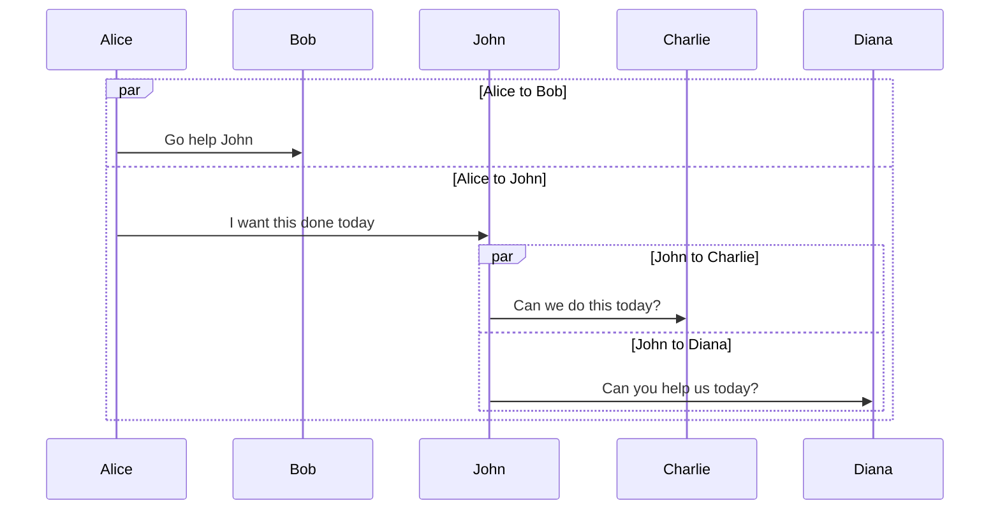

related: [[tool optimize]]

---

可以在這裡找也滿快的
[PKMer\_PKMer](https://pkmer.cn/)

[GitHub - Sergei-Korneev/obsidian-local-images-plus: This repo is a reincarnation of obsidian-local-images plugin which main aim was downloading images in md notes to local storage.](https://github.com/Sergei-Korneev/obsidian-local-images-plus)

[GitHub - twibiral/obsidian-execute-code: Obsidian Plugin to execute code in a note.](https://github.com/twibiral/obsidian-execute-code)

[Make.md](https://www.make.md/)

[Outliner.md - Supercharged outliner plugin](https://outliner.md/)

[RyotaUshio/obsidian-pdf-plus: The most Obsidian-native PDF annotation, viewing & editing tool ever. Comes with optional Vim keybindings.](https://github.com/RyotaUshio/obsidian-pdf-plus)

[mwoz123/swiss-army-knife-obsidian](https://github.com/mwoz123/swiss-army-knife-obsidian)

[GitHub - mgmeyers/obsidian-smart-typography: Converts quotes to curly quotes, dashes to em dashes, and periods to ellipses](https://github.com/mgmeyers/obsidian-smart-typography)

[l1xnan/obsidian-better-export-pdf: Obsidian PDF export enhancement plugin](https://github.com/l1xnan/obsidian-better-export-pdf)

[chrisgurney/obsidian-note-toolbar：Obsidian 外掛程式為筆記提供了一個靈活的上下文感知工具列。 --- chrisgurney/obsidian-note-toolbar: Plugin for Obsidian providing a flexible way to context-aware toolbars for your notes.](https://github.com/chrisgurney/obsidian-note-toolbar)

- [GitHub - IdreesInc/Waypoint: Obsidian plugin that gives you the power to generate dynamic MOCs in your folder notes. Enables folders to show up in the graph view and removes the need for messy tags!](https://github.com/IdreesInc/Waypoint)
	- folder level 的 moc, 自動產生
- [PKMer\_Obsidian 插件：Editing Toolbar 必装的可视化编辑工具](https://pkmer.cn/Pkmer-Docs/10-obsidian/obsidian%E7%A4%BE%E5%8C%BA%E6%8F%92%E4%BB%B6/editing-toolbar/)
- https://github.com/xRyul/obsidian-image-convert
- er/releases -> img scale
- [Benature/obsidian-text-format：格式化 Obsdidian.md 中選定的文本 --- Benature/obsidian-text-format: Format seleted text in Obsdidian.md](https://github.com/Benature/obsidian-text-format)
- say u want to use tag to mgmt https://github.com/pjeby/tag-wrangler
- obs space repitiion <-> anki
- 自動補全  [tth05/obsidian-completr: Auto-completion plugin for the obsidian editor.](https://github.com/tth05/obsidian-completr?tab=readme-ov-file)
	- https://gist.github.com/eyturner/3d56f6a194f411af9f29df4c9d4a4e6e
- Advanced URI: You can use this to open other vaults, switch workspaces without using a graphical user interface, and append content to notes, etc. Example command to insert clipboard content into a note with a shell command: start "" obsidian://advanced-uri?vault=Vault_name&filepath=Filename.md&data={{clipboard}}&mode=append (on Windows). Another way, without Advanced URI, is to use something like echo {{clipboard}} >> Filename.md (on Windows).
- cMenu: When you select text, this plugin opens a small modal of buttons for text formatting and other actions. You can add shell commands to the mix!
- Customizable Sidebar: Allows you to add new left side menu icons that fire what ever Obsidian command you want - including shell commands!
- Text Expander: If you want to write codeblocks in your markdown note files and execute them, then Text Expander is the solution for you. Shell commands focuses on bringing short, rarely changed terminal commands at your fingertips via hotkeys. You can run longer scripts with Shell commands too by writing them into a bash/batch file and executing that file as a command, but if you need to view the script before executing it, or make changes regularly, then Shell commands is not so optimal for your situation, and you might benefit more from Text Expander. But of course, you can also have both if you like.
- [cristianvasquez/obsidian-snippets-plugin](https://github.com/cristianvasquez/obsidian-snippets-plugin)
- [akaalias/text-expander-plugin: A bare-bones and opinionated proof-of-concept text expander utility for Obsidian](https://github.com/akaalias/text-expander-plugin)
- [daledesilva/obsidian_ink](https://github.com/daledesilva/obsidian_ink?tab=readme-ov-file)
- [GitHub - Taitava/obsidian-shellcommands: Execute system commands via hotkeys or command palette in Obsidian (https://obsidian.md). Some automated events are also supported, and execution via URI links.](https://github.com/Taitava/obsidian-shellcommands)
- [# 两年后，我还在用的 Obsidian 插件](https://zhuanlan.zhihu.com/p/570867991)

[GitHub - aleksey-rezvov/obsidian-local-images](https://github.com/aleksey-rezvov/obsidian-local-images)

# good site on plugin
- [PKMer_PKMer](https://pkmer.cn/#home)

# ai related
- [(462) 两款AI插件，让Obsidian更强大 - YouTube](https://www.youtube.com/watch?v=W8YkZw7_gpA)
	- ➡︎ Text Generator: [https://github.com/nhaouari/obsidian-...](https://www.youtube.com/redirect?event=video_description&redir_token=QUFFLUhqbEhqbXc1VXA5SkJIeHpZUElIY1dicEZNLTlnQXxBQ3Jtc0trTzZuLU1iSklPdm1aQXlEVm5hN3pzQW45UHpjOUV3b0dab29oOVltU2ZBdDRkSUhOakN6Zmp6eldmV3FPWTZIcDRmTnRKdDlQZUwxa3RoWGN2NGFSMkpXNjdncThlVTdpWXVrTHBWaTBOWHpSazBkVQ&q=https%3A%2F%2Fgithub.com%2Fnhaouari%2Fobsidian-textgenerator-plugin&v=W8YkZw7_gpA) ➡︎ Copilot: [https://github.com/logancyang/obsidia...](https://www.youtube.com/redirect?event=video_description&redir_token=QUFFLUhqbVFPQ04zTzRLTlRMdW5VenNjZnN1TEZCS2M1QXxBQ3Jtc0tsb25zdXdSNWtpcVhmS0szdGw1WDZJODZrMWN5czJOMmFnWWRacW9mU2tJeThuYmI4cHZ6eGwtZ0RiRWlWYUxDOTlPUVhGZTdtcmNaa3NUamVQcG5mSXNaZWxaU3RELVlGYnpWM25GMmQ2bHZ1X3gyYw&q=https%3A%2F%2Fgithub.com%2Flogancyang%2Fobsidian-copilot&v=W8YkZw7_gpA)

- Markdown prettifier
- [(457) Obsidian 新手教程 Ⅰ：8 個用法完全解析，一站式入門丨雙向鏈接筆記軟件 | Full Course for Beginners【二一的筆記】 - YouTube](https://www.youtube.com/watch?v=XeJ21baSV2g&t=116s)
- [joethei/obsidian-plantuml：在 Obsidian.md 中產生 PlantUML 圖 --- joethei/obsidian-plantuml: Generate PlantUML Diagrams inside Obsidian.md](https://github.com/joethei/obsidian-plantuml?tab=readme-ov-file)
- commander: 右邊的選單可以多 command, liker export to pdf
- setting search
- dataView -> 如果你有類似 notion 那種顯示 data like db 的需求可以裝-> can use sql
- book search -> 幫你建立 book note 的 template
- advanced table
- [附件管理](https://pkmer.cn/Pkmer-Docs/10-obsidian/obsidian%E7%A4%BE%E5%8C%BA%E6%8F%92%E4%BB%B6/attachment-management/)
- 要有自己的 trash 系統 https://obsidian.md/plugins?search=obsidian-trash-explorer, https://pkmer.cn/Pkmer-Docs/10-obsidian/obsidian%E7%A4%BE%E5%8C%BA%E6%8F%92%E4%BB%B6/obsidian-trash-explorer/
- [ozntel/file-tree-alternative: This Obsidian Plugin allows users to have a different file explorer experience.](https://github.com/ozntel/file-tree-alternative)
- css snipet
	- [Dmytro-Shulha/obsidian-css-snippets: Most common appearance solutions for Obsidian now in a single place. Initially collected by Klaas: https://forum.obsidian.md/t/how-to-achieve-css-code-snippets/8474](https://github.com/Dmytro-Shulha/obsidian-css-snippets)
- create new note and asking for title input
	- https://wiki.sascha-kasper.com/obsidian/tweaks/templater-script-ask-for-note-title/
	- https://www.reddit.com/r/ObsidianMD/comments/125vc7h/note_name_prompt/
- [Obsidian 插件：Slash Commander](https://pkmer.cn/Pkmer-Docs/10-obsidian/obsidian%E7%A4%BE%E5%8C%BA%E6%8F%92%E4%BB%B6/slash-commander/) -> 自動 slash command
- 貼上圖片要你命名 https://github.com/reorx/obsidian-paste-image-rename
- ref
	- https://pkmer.cn/Pkmer-Docs/10-obsidian/obsidian%E7%A4%BE%E5%8C%BA%E6%8F%92%E4%BB%B6/obsidian%E7%A4%BE%E5%8C%BA%E6%8F%92%E4%BB%B6/
	- [(447) Best Obsidian Plugins You Should Install (2024) - YouTube](https://www.youtube.com/watch?v=_8wZ-kSBQWs)
- https://github.com/joethei/obsidian-plantuml?tab=readme-ov-file
- mermaid 原生支持
	- https://mermaid.js.org/syntax/sequenceDiagram.html 

